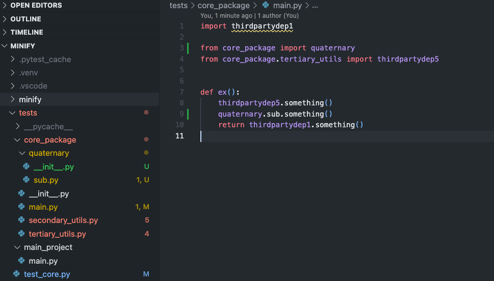
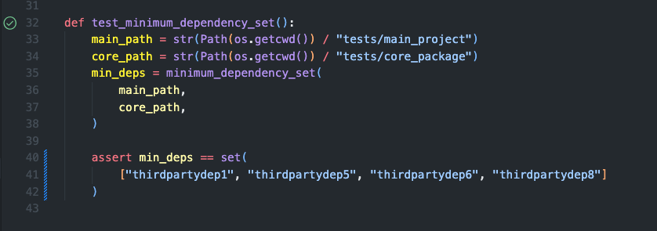

# Packr: Python Package Tree Shaker

Internal core packages quickly grow out of hand with multiple teams contributing to them and sharing them across services, infrastructure, and scripts.

When someone starts a new project and adds the core package as a dependency, the environment/image size instantly increases by hundreds of megabytes or gigabytes.

### Notice 

If only a single independent constant was imported, the whole package needs to be added as a dependency. Is that really necessary? The new project has no use for 99.9% of the internal package code.

Optimally, the solution would be to split the package into smaller packages. Realistically, this is very hard to achieve because of 1) cross-dependencies, 2) having to refactor MANY projects/scripts/pipelines as well as developer and onboarding tools/documents.

### A solution?

If we knew what parts of a package are needed in a project, then we could technically analyze the dependency graph and prune everything that isn’t needed before installing!

Smaller environments means less installation time, faster CI/CD pipelines, happier developers, and less storage space needed for installed packages.

In the very first trial of v0.0 of this, build times were reduced from 4 minutes to 10 seconds. In my case, the core package was not even that large (~700MB), which was reduced to 10MB only by installing only some of the dependencies.

### Some terminology
`Target package`: the package that is to be pruned of unnecessary dependencies

`Project package`: the project that uses the target package.

### How it works
- Scan all the files in the project package and list modules needed from target package
- Find in turn the dependencies needed by those modules (recursively)
- Return a list of the minimum required dependencies to make the target package work in this project (no import errors)
- Output a new temporary `requirements.txt` or `pyproject.toml` for installing the target package as part of a deploy

### TODO:

- [x] Create a function to calculate the minimum dependencies required by a core package to work within a project based on what parts are used

- [x] Create a command line interface to this function and more

- [ ] Create a function that outputs a requirements.txt with those min dependencies

### Tests
Here is an example test with some slightly complicated dependencies. You can see how the set of dependencies needed by the project to work is returned, and `secondary_utils.py`'s dependencies are ignored since this file is not imported into main_project.

